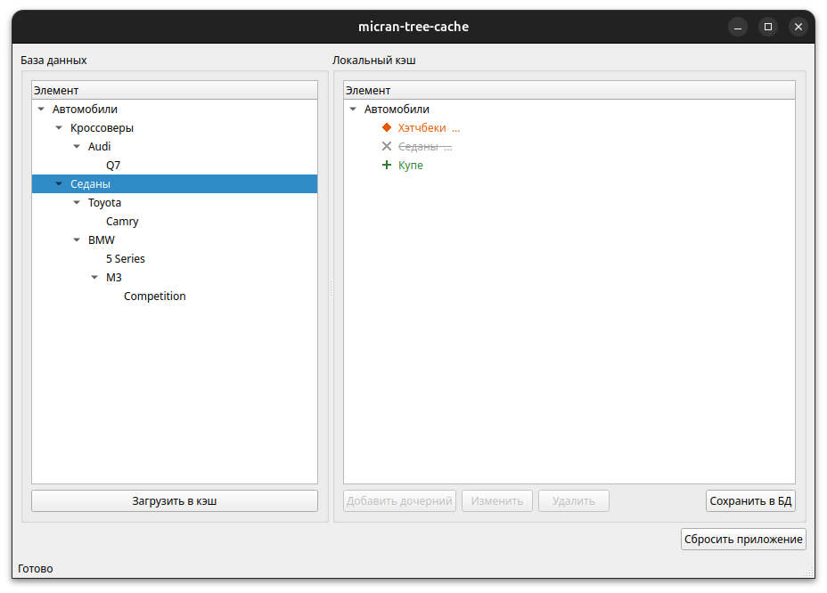

# micran-tree-cache

Тестовое задание для компании «Микран». Реализация локального кэша древовидной базы данных. 

## Описание

Приложение демонстрирует работу с **локальным кэшем** большой древовидной базы данных. База — дерево однородныъ элементов, каждый со строковым полем. Полная загрузка БД невозможна, поэтому пользователь загружает элементы по одному в кэш, редактирует их локально и одним действием применяет изменения в БД.

Обращение к БД происходит строго в двух случаях: загрузка элемента и применение изменений. В остальное время все операции выполняются только над кэшем. При удалении элемент не удаляется из базы данных, а помечаеся как удалённый, становится недоступным для редактирования, а его потомки автоматически получают такую же пометку. Кэш честно показывает неполноту загруженного дерева, чтобы не вводить пользователя в заблуждение.

## Возможности

- Две панели: эмуляция БД (слева) и локальный кэш (справа).
- Загрузка элементов из БД в кэш по одному с автоматическим построением иерархии: связанные элементы (родитель-потомок) объединяютсся автоматически.
- Операции над кэшем: добавление дочернего элемента, изменения строкового поля, каскадное мягкое удаление.
- Применение всех изменений в БД одним действием.
- Сброс приложения в исходное состояние.
- Визуальные различия состояний элементов: обычный, новый, изменённый, удалённый, а также элемент с незагруженными потомками.

## Интерфейс



Слева - эмуляция БД, справа - кэш. Изменённый элемент выделен, оранжевым, новый - зелёным, удалённый - серым зачёркнутым; многоточие обозначает наличие незагруженных потомков.

## Технологии

- **C++20**
- **Qt 5.15+**
- **CMake** (>= 3.16)

## Требования

Установка зависимостей в Debian/Ubuntu:

```bash
sudo apt install build-essential cmake qtbase5-dev
```

## Сборка

```bash
cmake -S . -B build -DCMAKE_BUILD_TYPE=Debug
cmake --build build -j
```

## Запуск

```bash
./build/micran-tree-cache
```

## Тесты

Проект покрыт юнит-тестами на Qt Test.

```bash
ctest --test-dir build --output-on-failure
```

## Структура проекта

```
.
├── cmake
├── CMakeLists.txt
├── docs
├── LICENSE
├── README.md
├── src
│   ├── application       # кэш, синхронизация, сброс
│   ├── domain            # сущности, статусы, порты
│   ├── infrastructure    # эмуляция БД и репозиторий
│   ├── main.cpp          # точка входа
│   └── presentation      # окно, модель провайдеры, делегат
└── tests
```

## Лицензия

Проект распространяется под лицензией MIT. См. файл [LICENSE](LICENSE).
